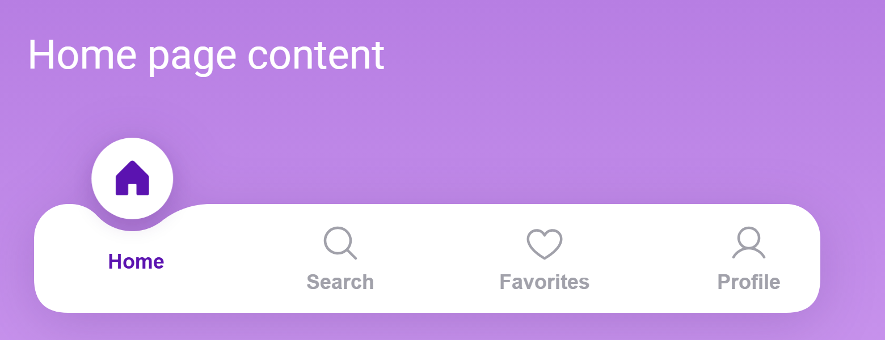

# Curved Bottom Navigation (React + MUI)

A floating bottom navigation bar for React. The selected tab's icon sits in a white circle, the bar curves smoothly underneath it, and both slide to the new tab when you switch.



## Features

- Floating circle with a curved notch that slides between tabs (eased, 400 ms)
- Icon pop-in and label lift on the selected tab
- Rounded corners stay rounded at the first and last tab, on any screen width
- Scales down slightly on narrow phones
- Respects the system "reduce motion" setting
- Slide animation updates the DOM directly, with no React re-render per frame

## Quick start

```bash
git clone https://github.com/<your-username>/curved-bottom-nav.git
cd curved-bottom-nav
npm install
npm run dev
```

Then open the URL Vite prints (usually http://localhost:5173).

## Usage

Copy the `src/components/CurvedBottomNav` folder into your project. It needs these dependencies:

```bash
npm install @mui/material @emotion/react @emotion/styled @phosphor-icons/react
```

```jsx
import { useState } from "react";
import { House, MagnifyingGlass, Heart, User } from "@phosphor-icons/react";
import CurvedBottomNav from "./components/CurvedBottomNav/CurvedBottomNav";

const tabs = [
  { label: "Home", icon: House },
  { label: "Search", icon: MagnifyingGlass },
  { label: "Favorites", icon: Heart },
  { label: "Profile", icon: User },
];

export default function App() {
  const [value, setValue] = useState(0);
  return <CurvedBottomNav tabs={tabs} value={value} onChange={setValue} />;
}
```

### Props

| Prop | Type | Default | Description |
|---|---|---|---|
| `tabs` | `{ label, icon }[]` | required | Tabs to show. `icon` is a Phosphor icon component. |
| `value` | `number` | required | Index of the selected tab. |
| `onChange` | `(index) => void` | required | Called with the index of the tab the user picks. |
| `activeColor` | `string` | `#5b13b0` | Color of the selected icon and label. |
| `inactiveColor` | `string` | `#a1a1aa` | Color of the other icons and labels. |
| `maxWidth` | `number` | `480` | Maximum width of the bar in px. |

### Customizing the shape

The shape settings are constants at the top of [`barShape.js`](src/components/CurvedBottomNav/barShape.js):

| Constant | Controls |
|---|---|
| `CIRCLE_SIZE` | Size of the floating circle |
| `CIRCLE_SINK` | How far the circle dips into the bar (depth of the notch) |
| `SIDE_GAP` / `BOTTOM_GAP` | Gap between the circle and the notch at its sides / bottom |
| `FILLET` | How soft the notch's edges are |
| `BAR_HEIGHT` / `BAR_RADIUS` | Bar height and corner radius |

## Scripts

| Command | What it does |
|---|---|
| `npm run dev` | Start the dev server |
| `npm run build` | Build for production into `dist/` |
| `npm run preview` | Preview the production build |
| `npm test` | Run the tests (Vitest) |
| `npm run lint` | Lint with Oxlint |

## Project structure

```
src/
  App.jsx                         Demo app with four pages
  components/CurvedBottomNav/
    CurvedBottomNav.jsx           The component
    barShape.js                   Geometry of the bar and notch
    barShape.test.js              Shape tests
```

## Built with

React 19, Vite, MUI, Phosphor Icons, Vitest.
